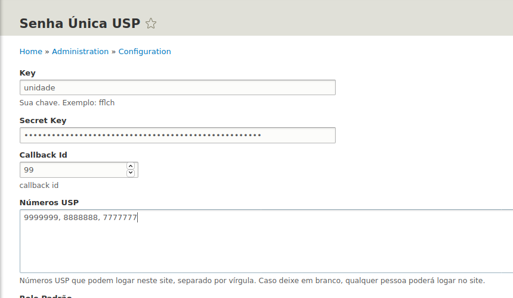
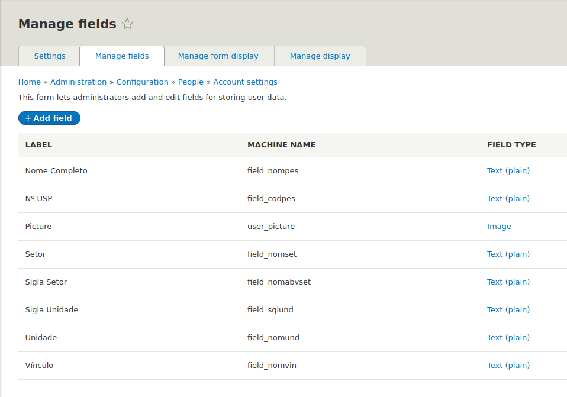

# senhaunicausp

Módulo que implementa o workflow de autenticação usando OAuth 1.0
na Universidade de São Paulo com toda parametrização necessária
para tornar fácil o uso desse tipo de autenticação usando Drupal.

## Instalação

```bash
cd drupal
composer require drupal/senhaunicausp
```

## Configuração

https://www.youtube.com/watch?v=BnWZhfQcjS8

### Obter consumer key e consumer secret do Oauth Consumidor USP na url:

https://uspdigital.usp.br/adminws/oauthConsumidorAcessar

### A Url a cadastrar no consumidor:

https://seusite.usp.br/login

### Adicione as informações em:

https://seusite.usp.br/admin/config/senhaunicausp

### Depois de configurado os usuários poderão logar com senha única USP usando a url:






https://seusite.usp.br/login

## Extras

### Você pode obter informações adicionais do OAuth USP

A ideia é: quando existem campos customizados para contas de usuários cadastrados em 
https://seusite.usp.br/admin/config/people/accounts/fields, eles serão preenchidos por este módulo, 
usando as seguintes chaves:

```bash
oauth               = account field name
----------------------------------------
uid                 = field_codpes
nomeAbreviadoSetor  = field_nomabvset
nomeSetor           = field_nomset
siglaUnidade        = field_sglund
nomeUnidade         = field_nomund
nomeVinculo         = field_nomvin
```

### Incluindo a opção de consumir os números USP de uma API

## Algumas implementações com webform e rules em:

https://uspdev.github.io/posts/drupal-senhaunica-rules

## Contribuindo com o projeto

### Passos iniciais

Siga o guia no site do [uspdev](https://uspdev.github.io/contribua)

### No Github faça um fork e clone o projeto

```bash
cd drupal/modules/contrib
git clone git@github.com:suacontagithub/senhaunicausp-drupal.git senhaunicausp
```

### Padrões de Projeto

Utilizamos a [PSR-2](https://www.php-fig.org/psr/psr-2/) para padrões de projeto. Ajuste seu editor favorito para a especificação.


